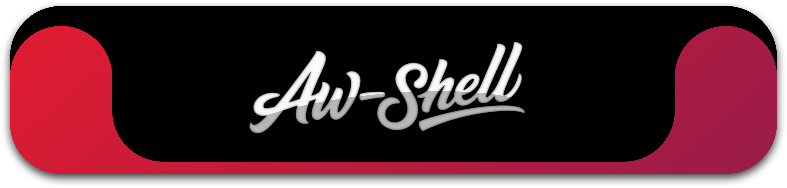
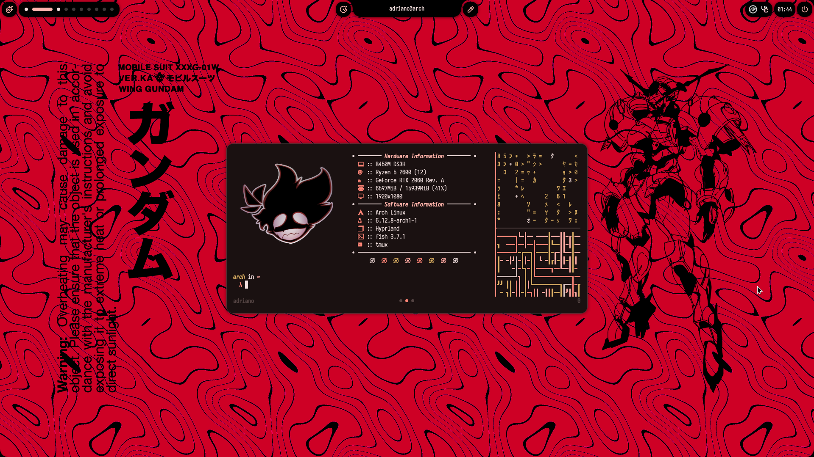
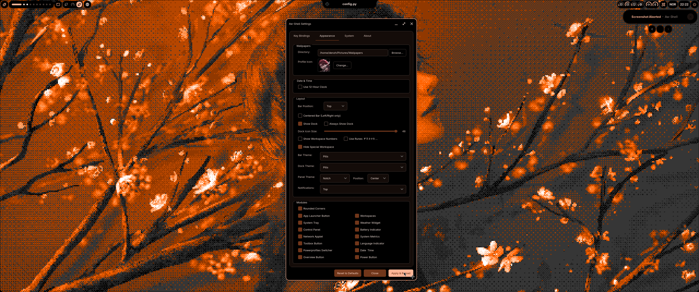
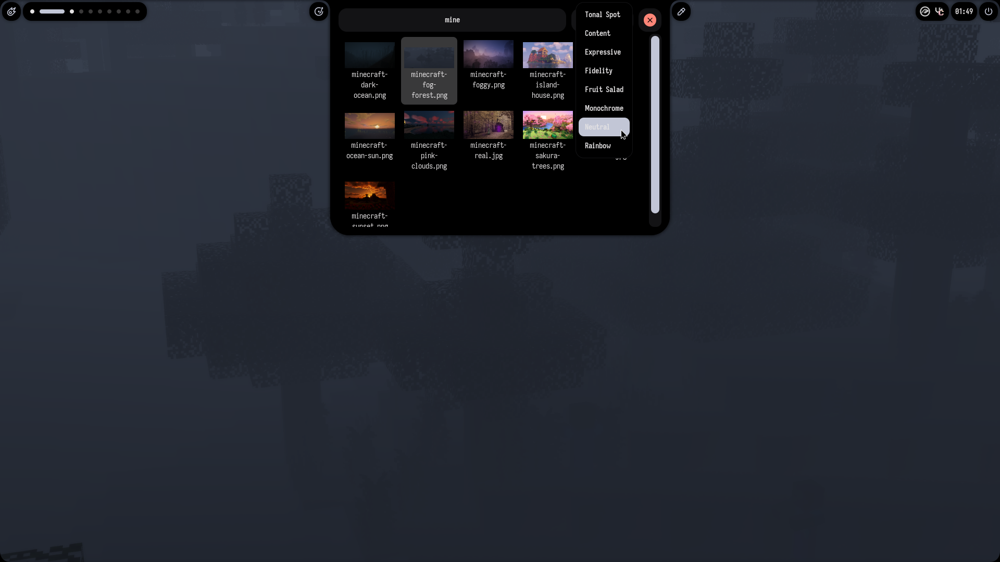
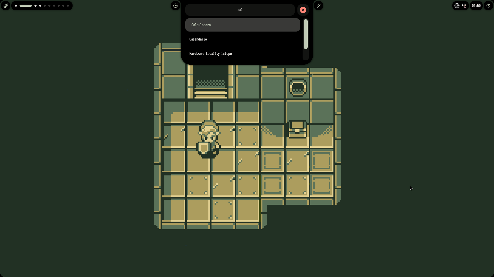
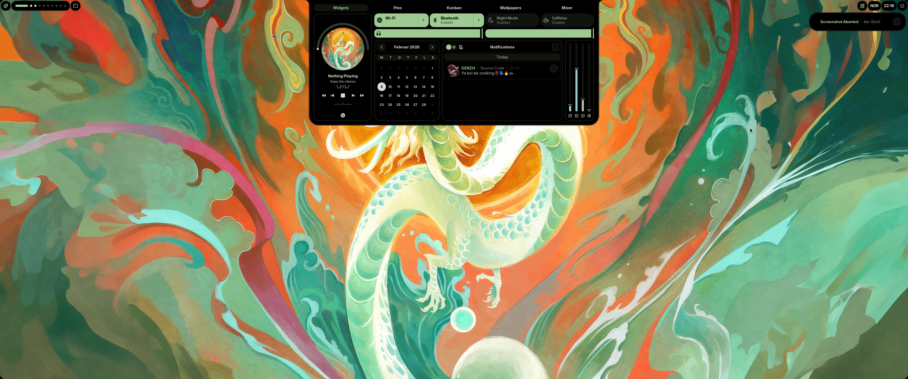

<p align="center">
<a href="https://github.com/awareness10/Aw-Shell">
  
  </a>
</p>

<p align="center">
  <sub><sup></sup></sub>
  <a href="https://github.com/hyprwm/Hyprland"></a>
  <a href="https://github.com/Fabric-Development/fabric/"></a>
  <sub><sup></sup></sub>
</p>

<p align="center">
  <a href="https://github.com/awareness10/Aw-Shell/actions/workflows/test.yml"></a>
  <a href="https://github.com/awareness10/Aw-Shell/actions/workflows/test.yml"></a>
</p>

> Forked from [Axenide/Ax-Shell](https://github.com/Axenide/Ax-Shell) - A hackable shell for Hyprland

---

<h2><sub></sub> Screenshots</h2>
<table align="center">
  <tr>
    <td colspan="5"></td>
  </tr>
  <tr>
    <td colspan="2"></td>
    <td colspan="1"></td>
    <td colspan="1" align="center"></td>
    <td colspan="2" align="center"></td>
  </tr>
</table>

<h2><sub></sub> Changes from Ax-Shell</h2>

Aw-Shell started from Ax-Shell, which is now deprecated upstream, and has since grown into its own project:

**Hyprland compatibility**
- **Lua config** — keybinds and settings generate a native Hyprland Lua config, compatible with Hyprland 0.56.2+ (including the 0.57 module changes)
- **Live theme updates** — border colors apply over Hyprland IPC after a wallpaper change, no reload needed

**Performance**
- **No process polling** — toolbox status (screen recorder, pomodoro, gamemode) is checked in-process by one shared poller instead of spawning `pgrep` and scripts every 2 seconds on every monitor
- **Event-driven notch hiding** — the notch reacts to Hyprland events per monitor instead of polling the active window twice a second
- **Shared pollers** — tray watcher and headset battery run once and serve every bar

**Multi-monitor**
- Monitor ids match screens, and the main monitor is whichever holds workspace 1 — no hard-coded connector names
- Tray icons on every bar; dashboard, launcher, workspaces and notifications open on the focused monitor
- Rounded corners and notch hiding work per monitor

**Settings & theming**
- **PySide6 (Qt6) settings window** — the first step of the migration to Qt, styled with [Glaze](https://github.com/Awareness10/Glaze); sizes itself to the screen it opens on
- **Color schemes** — the selected Matugen scheme is remembered and applied immediately; the full palette is written to `config/colors.json` for other tools
- **Matugen 4** support
- **Idle** — "Suspend when idle" option, a working Caffeine toggle, and a single hypridle instance after Apply

**New & rewritten**
- **Bluetooth** — rewritten on BlueZ D-Bus and `bluetoothctl`
- **Updater** — fresh version checks via the GitHub API, changelog grouped by version with one row per change
- **Peripherals** — headset battery (via `headsetcontrol`) and Logitech mouse battery in the control panel
- **Screen recorder indicator**, weather widget, and tooltips throughout
- **Fixes** — Wi-Fi no longer creates duplicate profiles, wallpaper thumbnails refresh when files change, metrics work without UPower, overview handles close confirmations

**Development**
- **`uv`** — reproducible installs with `uv sync` instead of a manual pip/venv setup
- **Tests & CI** — unit tests with coverage on every push
- **Code quality** — dead code removed, `pathlib` over `os.path`, cleaned imports and typings

<h2><sub></sub> Installation</h2>

> [!NOTE]
> You need a functioning Hyprland installation (0.56.2 or newer).
> This will also enable NetworkManager if it is not already enabled.

### Arch Linux

> [!TIP]
> This command also works for updating an existing installation!

**Run the following command in your terminal once logged into Hyprland:**
```bash
curl -fsSL https://raw.githubusercontent.com/Awareness10/Aw-Shell/main/install.sh | bash
```

### Manual Installation

1. Install [uv](https://docs.astral.sh/uv/):
    ```bash
    curl -LsSf https://astral.sh/uv/install.sh | sh
    ```

2. Install system dependencies (Arch Linux):
    - [fabric-cli](https://github.com/Fabric-Development/fabric-cli)
    - [Gray](https://github.com/Fabric-Development/gray)
    - [Matugen](https://github.com/InioX/matugen)
    - `awww` `brightnessctl` `cava` `cliphist` `ddcutil`
    - `bluez-utils` `gobject-introspection` `gpu-screen-recorder` `headsetcontrol`
    - `hypridle` `hyprlock` `hyprpicker` `hyprshot` `hyprsunset`
    - `imagemagick` `libnotify` `networkmanager` `network-manager-applet`
    - `nm-connection-editor` `noto-fonts-emoji` `nvtop` `playerctl`
    - `power-profiles-daemon` `swappy` `tesseract` `tesseract-data-eng`
    - `tesseract-data-spa` `tmux` `unzip` `upower` `uwsm` `vte3`
    - `webp-pixbuf-loader` `wl-clipboard`

3. Clone, install Python deps, and run:
    ```bash
    git clone https://github.com/Awareness10/Aw-Shell.git ~/.config/aw-shell
    cd ~/.config/aw-shell
    uv sync
    uwsm app -- .venv/bin/python main.py > /dev/null 2>&1 & disown
    ```

<h2><sub></sub> Features</h2>

- App Launcher
- Bluetooth Manager
- Caffeine / Idle Control
- Calculator
- Calendar
- Clipboard Manager
- Color Picker
- Customizable UI
- Dashboard
- Dock
- Headset & Mouse Battery
- Emoji Picker
- Kanban Board
- Network Manager
- Notifications
- OCR
- Pins
- Power Manager
- Power Menu
- Screen Recorder (with recording indicator)
- Screenshot
- Settings
- System Tray
- Terminal
- Tmux Session Manager
- Update checker
- Vertical Layout
- Wallpaper Selector
- Weather
- Workspaces Overview
- Multi-monitor support

---

> Originally based on [Ax-Shell](https://github.com/Axenide/Ax-Shell) by [Axenide](https://github.com/Axenide). Consider supporting the original author on [Ko-fi](https://ko-fi.com/Axenide).
